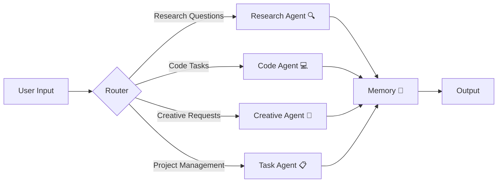
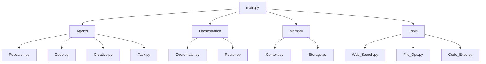
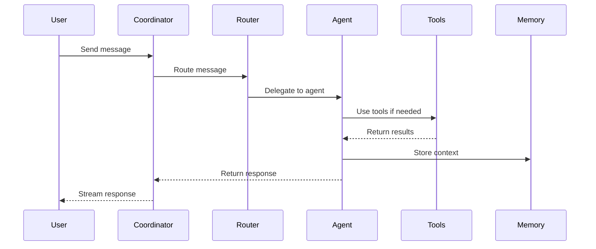

# MCP AI Agent 🤖

[](https://opensource.org/licenses/Apache-2.0)
[](https://www.python.org/downloads/)
[](https://openrouter.ai/)

A Multi-Capability Platform AI Agent system featuring specialized AI agents for research, code development, creative tasks, and project management. Built with OpenRouter integration and persistent conversation memory.



## Features ✨

| Category | Features |
|----------|----------|
| **Core Capabilities** | <ul><li>👥 **Multi-Agent System**: Four specialized AI agents</li><li>🧠 **Intelligent Routing**: Automatic agent selection</li><li>💾 **Persistent Memory**: SQLite-based storage</li></ul> |
| **Tool Integration** | <ul><li>🌐 **Web Search**: Real-time information retrieval</li><li>📁 **File Operations**: Secure document handling</li><li>💻 **Code Execution**: Sandboxed environment</li></ul> |
| **User Experience** | <ul><li>💻 **Interactive CLI**: Rich terminal interface</li><li>⚡ **Real-time Streaming**: Instant responses</li><li>🔄 **Session Management**: Context preservation</li></ul> |
| **Security** | <ul><li>🔒 **Sandboxed Execution**: Safe code processing</li><li>🚫 **File Restrictions**: Protected directories</li><li>🛡️ **Safe Mode**: Production-ready controls</li></ul> |

## Installation and Setup ⚙️

### Prerequisites
- Python 3.11+
- [OpenRouter API Key](https://openrouter.ai/keys)

### Quick Start 🚀
```bash


# Add: OPENROUTER_API_KEY = your_api_key_here


pip install -r requirements.txt


python main.py interactive
```

### Detailed Configuration
Edit `config.py` to customize:
```python
# Model Settings
MODEL_NAME = "openai/gpt-oss-20b:free"  # OpenRouter model
MAX_TOKENS = 4000  # Response length limit

# Security Settings
SAFE_MODE = True  # Enable security restrictions
ALLOWED_FILE_TYPES = ['.txt', '.py', '.md']  # Permitted file operations
```

## Agent Types 🧠

| Agent | Icon | Capabilities | Best For |
|-------|------|--------------|----------|
| **Research Agent** | 🔍 | Web search, fact-checking, data analysis | Information gathering, research queries, fact verification |
| **Code Agent** | 💻 | Code generation, debugging, optimization | Programming tasks, software development, technical problems |
| **Creative Agent** | 🎨 | Content creation, storytelling, brainstorming | Writing, creative projects, ideation, content generation |
| **Task Agent** | 📋 | Project management, planning, coordination | Project planning, task breakdown, workflow optimization |

## Usage Examples 💬

### Interactive Mode
```bash
$ python main.py interactive

> /agents
Available agents:
  🔍 Research - Information gathering and verification
  💻 Code - Programming and technical tasks
  🎨 Creative - Content creation and ideation
  📋 Task - Project planning and management

> How do quantum computers work?
[Research Agent 🔍] 
Quantum computers use quantum bits (qubits) that can exist in superposition...
```

### Single Query Mode
```bash
python main.py ask "Write Python code to calculate Fibonacci sequence" --agent code
```

### CLI Commands
| Command | Description | Example |
|---------|-------------|---------|
| `interactive` | Start chat session | `python main.py interactive` |
| `ask "message"` | Single question | `ask "Explain blockchain"` |
| `list-agents` | Show agent capabilities | `list-agents` |
| `--agent` | Target specific agent | `ask "Design logo" --agent creative` |

## Interactive Commands 🎮

| Command | Description |
|---------|-------------|
| `/help` | Show available commands |
| `/agents` | List all agents and capabilities |
| `/switch <agent>` | Switch to specific agent |
| `/history` | Show conversation history |
| `/clear` | Clear conversation history |
| `/status` | Show system status |
| `/exit` | Exit the system |

## Project Structure 📂



```
mcp-ai-agent/
├── agents/              # 🤖 Agent implementations
│   ├── base.py         # Base agent class
│   ├── research.py     # 🔍 Research agent
│   ├── code.py         # 💻 Code agent
│   ├── creative.py     # 🎨 Creative agent
│   └── task.py         # 📋 Task management agent
├── orchestration/       # 🎭 Multi-agent coordination
│   ├── coordinator.py  # Main coordinator
│   └── router.py       # Message routing
├── memory/             # 🧠 Memory management
│   ├── context.py      # Conversation context
│   └── storage.py      # Persistent storage
├── tools/              # 🛠️ Tool implementations
│   ├── web_search.py   # 🌐 Web search tool
│   ├── file_ops.py     # 📁 File operations
│   └── code_exec.py    # ⚡ Code execution
├── utils/              # 🔧 Utilities
│   ├── logger.py       # 📝 Logging system
│   └── cli_helpers.py  # 💻 CLI utilities
├── config.py           # ⚙️ Configuration management
└── main.py            # 🚀 Main entry point
```

## Safety Features 🔒

### Security Protocols
| Feature | Protection | Implementation |
|---------|------------|----------------|
| **Code Sandboxing** | Malicious code execution | Timeout limits, resource constraints |
| **File Operations** | Unauthorized access | Whitelisted directories, file type restrictions |
| **Output Validation** | Resource exhaustion | Response length limits, token counting |
| **Session Isolation** | Data leakage | Separate memory contexts, encryption |

### Environment Variables
| Variable | Required | Description |
|----------|----------|-------------|
| `OPENROUTER_API_KEY` | ✅ | Your OpenRouter API key |

## API Architecture 🏗️



## Contributing 🤝

We welcome contributions! Here's how to get started:

1. 🍴 Fork the repository
2. 🌿 Create a feature branch
3. 💻 Make your changes
4. ✅ Add tests if applicable
5. 📤 Submit a pull request

Please ensure your code follows the existing style and includes appropriate documentation.


### Common Issues

| Issue | Solution |
|-------|----------|
| API Key Error | Set `OPENROUTER_API_KEY` |
| Import Errors | Run `pip install -r requirements.txt` |
| Agent Not Responding | Check network connection and API key validity |
| Memory Issues | Clear conversation history with `/clear` command |


